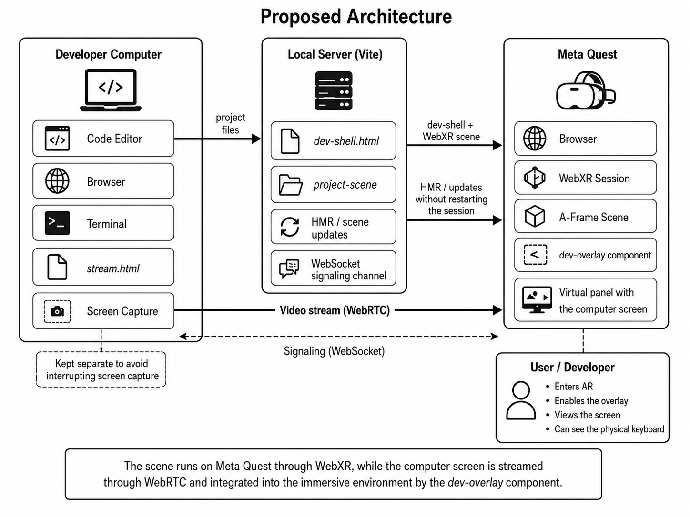

# WebXR Live Coding · Dev Overlay for Meta Quest

WebXR Live Coding is a prototype development workflow for faster iteration in immersive WebXR applications.

It allows a developer to build and test an A-Frame/WebXR scene in AR on Meta Quest while keeping the desktop visible inside the scene through a Dev Overlay component.

The prototype uses A-Frame, WebXR, WebRTC, Vite and WebSocket signaling to stream the computer screen into the headset, reload only the editable project scene during development, and keep the main AR shell alive.

It also supports dragging the overlay screen directly inside the AR scene with the Meta Quest controller.

---

## Architecture



**Overview of the proposed workflow.** The AR shell runs on Meta Quest through WebXR, while the desktop is streamed through WebRTC and integrated into the immersive scene by the `dev-overlay` component.

## Main idea

During WebXR development, developers often need to constantly switch between the headset and the computer to check code, logs, the browser, or the terminal.

This prototype explores a different workflow:

```txt
stay inside the Meta Quest AR session
see the desktop inside the WebXR scene
edit the A-Frame scene on the computer
save the file
see the scene update in AR
move the desktop overlay directly with the Quest controller
```

Instead of reloading the entire WebXR page, the project separates the stable AR shell from the editable scene.

```txt
dev-shell.html
→ stable AR shell
→ owns the WebXR AR session
→ owns the Dev Overlay component
→ owns the WebRTC stream receiver
→ owns the project-root container

src/project/project-scene.html
→ editable A-Frame scene
→ loaded inside project-root
→ can be changed during development

src/project/project-loader.js
→ loads and remounts the editable scene
→ supports live scene updates without reloading the shell

src/dev-overlay.js
→ A-Frame component that creates the virtual desktop screen
→ receives the WebRTC stream
→ supports toggling, selective hiding and dragging

src/dev-overlay-position.js
→ optional code-based overlay position and size configuration
→ can update the overlay without reloading dev-shell.html

public/stream.html
→ opened on the computer
→ captures and streams the desktop
```

---

## What the prototype does

* Streams the computer screen into a WebXR AR scene
* Uses WebRTC for desktop streaming
* Uses a custom WebSocket endpoint for WebRTC signaling
* Runs inside Meta Quest Browser
* Keeps the AR shell alive during normal scene edits
* Reloads only the editable project scene
* Allows live A-Frame scene changes through Vite HMR
* Allows the overlay screen to be dragged inside the AR scene with the Quest controller
* Allows the overlay position and size to also be adjusted through code
* Allows selected scene elements to disappear when the overlay is active
* Keeps instructions, labels or debugging panels visible when needed

---

## Technologies

* A-Frame
* WebXR
* WebRTC
* Vite
* WebSocket
* JavaScript
* HTML

---

## Project structure

```txt
webxr-live-coding/
├── package.json
├── package-lock.json
├── vite.config.js
├── README.md
├── dev-shell.html
├── public/
│   └── stream.html
└── src/
    ├── dev-overlay.js
    ├── dev-overlay-position.js
    └── project/
        ├── project-loader.js
        └── project-scene.html
```

---

## How to run

Install dependencies:

```bash
npm install
```

Start the Vite development server:

```bash
npm run dev -- --host
```

Vite will show URLs similar to:

```txt
Local:   https://localhost:5173/
Network: https://192.168.1.51:5173/
```

Use the `Network` URL on the Meta Quest.

---

## How to test

### 1. Open the stream page on the computer

```txt
https://localhost:5173/stream.html
```

Click:

```txt
Share screen
```

Choose the screen, window or tab you want to share.

---

### 2. Open the AR shell on Meta Quest

In Meta Quest Browser, open:

```txt
https://YOUR_LOCAL_IP:5173/dev-shell.html
```

Example:

```txt
https://192.168.1.51:5173/dev-shell.html
```

Then:

1. Enter AR mode
2. Press the blue overlay button
3. The streamed computer screen should appear inside the scene
4. Edit the project scene on the computer
5. Save the file
6. The scene should update without leaving AR

---

## Recommended development flow

```txt
Computer:
1. Run npm run dev -- --host
2. Open /stream.html
3. Click Share screen
4. Edit src/project/project-scene.html
5. Save the file

Meta Quest:
1. Open /dev-shell.html
2. Enter AR mode
3. Press the blue overlay button
4. Watch the desktop stream inside the scene
5. Drag the overlay screen with the Quest controller if needed
6. Keep testing without leaving AR
```

---

## Editing the project scene

The editable scene is located at:

```txt
src/project/project-scene.html
```

This file should contain only A-Frame entities.

Example:

```html
<a-box
  position="0 1 -2"
  width="0.5"
  height="0.5"
  depth="0.5"
  color="#38BDF8">
</a-box>
```

Changing the color:

```html
color="#F97316"
```

After saving the file, the scene content is remounted inside the stable shell.

The full WebXR page does not need to reload.

---

## Project scene rules

`src/project/project-scene.html` must not include:

```html
<html>
<head>
<body>
<a-scene>
```

The stable shell already owns the `<a-scene>`.

Use only internal A-Frame entities, such as:

```html
<a-box></a-box>
<a-plane></a-plane>
<a-text></a-text>
<a-entity></a-entity>
<a-sphere></a-sphere>
<a-cylinder></a-cylinder>
<a-cone></a-cone>
```

The editable scene is mounted inside:

```html
<a-entity id="project-root"></a-entity>
```

Do not rename or remove:

```html
id="project-root"
```

---

## Dragging the overlay screen in AR

The overlay screen can be repositioned directly inside the AR scene using the Meta Quest controller.

Basic interaction:

```txt
1. Enter AR mode
2. Enable the Dev Overlay
3. Point the Quest controller at the overlay screen
4. Hold the trigger
5. Move the controller to reposition the screen
6. Release the trigger to drop the screen
```

This makes it possible to adjust the editor view while staying inside the headset, instead of changing the overlay position only through code.

The feature is useful when the screen is blocking part of the scene, when the developer wants to place it closer to the object being edited, or when the overlay needs to be moved away to check the AR content.

---

## Code-based overlay position

The overlay can also be positioned through code using:

```txt
src/dev-overlay-position.js
```

Example:

```js
export const overlayPosition = {
  x: 0,
  y: 1.3,
  z: -1.25
};

export const overlaySize = {
  width: 1.35,
  height: 0.76
};
```

Position values:

```txt
x → horizontal position
y → vertical position
z → depth
```

In A-Frame, more negative `z` values move the overlay farther in front of the user.

Example:

```js
export const overlayPosition = {
  x: 0.15,
  y: 1.45,
  z: -1.45
};

export const overlaySize = {
  width: 1.5,
  height: 0.84
};
```

After saving `src/dev-overlay-position.js`, Vite HMR reapplies the overlay configuration without reloading `dev-shell.html`.

The draggable interaction and the code-based configuration can coexist. The code file is useful for defining a default position, while dragging is useful for quick adjustments during a live AR session.

---

## Selective hiding

The overlay can hide selected scene elements when it is active.

To make an element disappear when the overlay is active, add:

```html
class="dev-overlay-hide-when-active"
```

Example:

```html
<a-plane
  class="dev-overlay-hide-when-active"
  rotation="-90 0 0"
  width="4"
  height="4"
  color="#111827">
</a-plane>
```

When the overlay is active:

```txt
elements with dev-overlay-hide-when-active → hidden
elements without dev-overlay-hide-when-active → remain visible
```

This allows the developer to clear part of the field of view while keeping titles, labels, instructions or debugging panels visible.

---

## Example project scene

Example content for:

```txt
src/project/project-scene.html
```

```html
<a-plane
  class="dev-overlay-hide-when-active"
  rotation="-90 0 0"
  width="5"
  height="5"
  color="#111827"
  opacity="0.9"
  position="0 0 -1.5">
</a-plane>

<a-text
  value="Live WebXR scene"
  align="center"
  color="#FFFFFF"
  position="0 2 -2.5"
  width="4">
</a-text>

<a-box
  position="0 0.7 -1.6"
  width="0.5"
  height="0.5"
  depth="0.5"
  color="#38BDF8">
</a-box>

<a-cone
  position="0.8 0.7 -1.6"
  radius-bottom="0.35"
  radius-top="0"
  height="0.7"
  segments-radial="4"
  color="#F97316">
</a-cone>

<a-text
  value="This text stays visible when the overlay is active"
  align="center"
  color="#E5E7EB"
  position="0 1.4 -2.4"
  width="3">
</a-text>
```

---

## How the live scene reload works

The shell loads the project scene using:

```js
import sceneHtml from './project-scene.html?raw';
```

The HTML is inserted into:

```html
<a-entity id="project-root"></a-entity>
```

When `project-scene.html` changes, the loader replaces only the content inside `project-root`.

The shell itself remains alive.

This preserves:

* the WebXR AR session
* the Dev Overlay component
* the WebRTC signaling connection
* the overlay button
* the stream page connection
* the current AR state

---

## Why the stable shell exists

Full page reloads can terminate or corrupt WebXR AR sessions on standalone headsets.

The shell avoids that by keeping the page that owns the AR session stable.

Instead of reloading:

```txt
entire page
```

the system reloads only:

```txt
editable project scene
overlay position configuration
```

This is why the architecture uses:

```txt
dev-shell.html
→ stable page

project-scene.html
→ editable scene content

dev-overlay-position.js
→ editable overlay layout config
```

---

## Stream page behavior

The stream page is located at:

```txt
public/stream.html
```

It captures the desktop using:

```js
navigator.mediaDevices.getDisplayMedia()
```

The stream page stays inside `public/` so it is served as a static page and does not get reloaded by Vite HMR.

This is important because if `stream.html` reloads, the browser stops the screen capture and the user must click **Share screen** again.

---

## Communication flow

```txt
Computer:
public/stream.html
→ captures the desktop
→ creates WebRTC offer

Vite WebSocket:
/dev-overlay-ws
→ forwards signaling messages

Quest:
dev-shell.html
→ receives WebRTC stream through dev-overlay
→ renders the desktop screen inside WebXR
```

Signaling messages include:

```txt
rtc:connect
rtc:offer
rtc:answer
rtc:ice
```

---

## What can be edited during AR

Safe to edit during an active AR session:

```txt
src/project/project-scene.html
src/dev-overlay-position.js
```

Avoid editing during an active AR session:

```txt
dev-shell.html
src/dev-overlay.js
src/project/project-loader.js
public/stream.html
vite.config.js
```

Reason:

```txt
dev-shell.html owns the WebXR AR session.
project-scene.html and dev-overlay-position.js are designed to update without a full page reload.
```

---

## Recommended demo flow

For a short demo video:

```txt
1. Start the Vite server
2. Open stream.html on the computer
3. Click Share screen
4. Open dev-shell.html on Meta Quest
5. Enter AR mode
6. Press the overlay button
7. Show the computer screen inside AR
8. Edit src/project/project-scene.html
9. Change the color or position of an A-Frame object
10. Save the file
11. Show the scene updating without leaving AR
12. Drag the overlay screen with the Quest controller
13. Show the screen being repositioned directly inside the AR scene
14. Toggle the overlay to show selective hiding
```

Suggested caption:

```txt
Live WebXR development inside Meta Quest AR using A-Frame, Vite and WebRTC.
```

---

## Troubleshooting

### The scene does not update after saving

Make sure you are editing:

```txt
src/project/project-scene.html
```

Do not edit `dev-shell.html` for normal scene changes.

---

### The overlay does not move after editing its position

Make sure you are editing:

```txt
src/dev-overlay-position.js
```

Then save the file and check the browser console for:

```txt
[dev-overlay-position] overlay config applied
```

If the overlay still does not move, restart the Vite server and test again.

---

### The overlay does not drag in AR

Make sure you are testing on the Meta Quest, not only in a desktop browser.

Then:

```txt
1. Enter AR mode
2. Enable the overlay
3. Point the controller ray at the overlay screen
4. Hold the trigger
5. Move the controller
6. Release the trigger
```

If dragging still does not work, reload `dev-shell.html`, reconnect the stream and try again.

---

### The browser asks to share the screen again

This usually means `stream.html` was reloaded.

Open it again and click:

```txt
Share screen
```

Avoid editing `public/stream.html` during a live test.

---

### The overlay is active but hidden elements reappear after saving

The loader should reapply the overlay visibility state after remounting the scene.

Make sure the elements that should disappear have:

```html
class="dev-overlay-hide-when-active"
```

---

### AR turns black or leaves passthrough

Make sure the shell does not use:

```html
<a-sky></a-sky>
```

Use transparent rendering:

```html
renderer="colorManagement: true; alpha: true"
background="transparent: true"
```

The current entry point for AR testing should be:

```txt
dev-shell.html
```

---

## Current main files

Use these files for the current workflow:

```txt
dev-shell.html
public/stream.html
src/dev-overlay.js
src/dev-overlay-position.js
src/project/project-loader.js
src/project/project-scene.html
vite.config.js
```

The recommended entry point for AR testing is:

```txt
dev-shell.html
```

---

## Summary

WebXR Live Coding provides a prototype workflow for developing A-Frame/WebXR scenes while staying inside a Meta Quest AR session.

The key idea is to separate the stable AR shell from the editable project scene and the editable overlay layout configuration.

```txt
dev-shell.html
→ keeps AR alive

project-scene.html
→ changes scene content during development

dev-overlay-position.js
→ changes the default overlay screen position and size

dev-overlay.js
→ streams the desktop into AR and supports dragging the overlay screen
```

This allows developers to edit A-Frame HTML content, see their desktop inside the headset, reposition the editor screen directly in AR, and keep the WebXR session alive during normal development.
